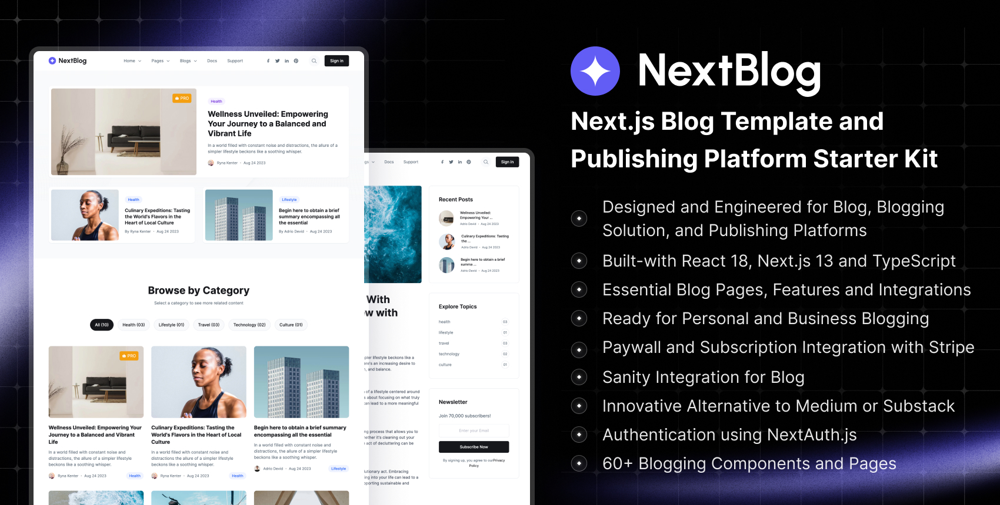

# NextBlog - Next.js Blog Template | Self-hosted Medium Alternative Built with Next.js

NextBlog is an innovative blog template specifically designed and engineered for top-tier blog sites, bespoke blogging solutions, and superior publishing platforms. It offers a complete blogging solution built on the Next.js framework, thereby eliminating the need to stress over design, frontend coding, or constructing functionalities.

## A Modern Self-Hosted Alternative to Medium, Substack, or Ghost
NextBlog stands as a sophisticated, faster, optimized, and modern alternative to blogging platforms such as Medium, Substack, and Ghost. It is a groundbreaking solution for bloggers, leveraging serverless tools and technologies to deliver a superior blogging experience.

## A Fully-Functional Solution for Building a Blogging Platform
NextBlog comes fully equipped with everything you need to build a thriving blogging platform. The template includes two unique homepage variations catered to personal and business blogs. Additionally, it features all the requisite blog pages, components, and web application pages. These features are not only functionally effective but also highly adaptable to meet varying user needs.

**Cutting-Edge Technology and Integrations:**
NextBlog utilizes advanced technologies like Next.js 13, React 18, and TypeScript. It integrates seamlessly with Sanity CMS and incorporates secure login functionality via NextAuth.

**Modern User-Centric Design:**
NextBlog is designed with a focus on user experience, following the latest design trends. It features unique blog page variations and a robust archive page.

**Monetization with Stripe:**
NextBlog allows you to monetize your content. You can charge users for articles or set member-only options. It has a ready-to-use paywall system to restrict access based on membership levels.

**Database Integration:**
NextBlog supports smooth database integration with PostgreSQL for high performance and scalability.

**Ease of Subscription Payments:**
NextBlog allows hassle-free subscription payments through Stripe integration.

**Quality Code and SEO Optimization:**
NextBlog guarantees premium code quality following Next.js's best practices and is highly optimized for SEO and performance. 

**Rich and Detailed Documentation:** 
NextBlog also includes comprehensive, easy-to-follow [documentation](https://nextjstemplates.com/docs)

**TypeScript:**
The template uses TypeScript, offering reliability and efficiency in your coding process.
